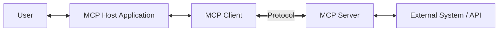

# MCP Architecture & Mechanics

## High-Level Architecture

The Model Context Protocol operates on a distinct **Client-Host-Server** model designed to separate the AI's reasoning logic from the specific implementations of external tools.

### Components

1.  **MCP Host:**
    *   The user-facing application where the AI model "lives" (e.g., Claude Desktop, Cursor IDE, or a custom AI application).
    *   It manages the user interface, the connection lifecycle, and security boundaries.

2.  **MCP Client:**
    *   A protocol-level component embedded within the Host.
    *   It establishes a 1:1 connection with an MCP Server.
    *   It translates the LLM's natural language intent into structured MCP requests (JSON-RPC).

3.  **MCP Server:**
    *   A standalone service that exposes specific capabilities (Tools, Resources, Prompts).
    *   It effectively acts as a gateway or "driver" for an external service (like Stripe, GitHub, or a local database).

## Transport Layers

MCP is transport-agnostic but primarily defines two standard transport mechanisms:

### 1. Stdio (Standard Input/Output)
*   **Use Case:** Local tools, secure enterprise environments, IDE integrations.
*   **Mechanism:** The Host spawns the Server as a customized subprocess. Communication happens over standard input (stdin) and output (stdout).
*   **Pros:** Ultra-low latency, highly secure (data never leaves the machine/network), simple to deploy locally.
*   **Cons:** Limited to the local machine; cannot easily be accessed remotely without tunneling.

### 2. HTTP with SSE (Server-Sent Events)
*   **Use Case:** Cloud-hosted agents, distributed systems, SaaS integrations.
*   **Mechanism:**
    *   **Server-to-Client:** Uses Server-Sent Events (SSE) to push messages and notifications.
    *   **Client-to-Server:** Uses standard HTTP POST requests.
*   **Pros:** Scalable, works over standard web infrastructure, firewall-friendly.
*   **Cons:** Higher latency due to HTTP overhead; requires TLS and authentication for security.

## Server Lifecycle

An MCP server's life involves four key stages:

1.  **Creation:** Defining capabilities (tools/resources) and implementing the logic.
2.  **Deployment:** Running the server either locally (stdio) or on a cloud platform (HTTP/SSE).
3.  **Operation:** Active handling of requests (ListTools, CallTool, ReadResource).
4.  **Maintenance:** Updates, logging, and security patching.

## Automation: The AutoMCP Revolution

One of the significant barriers to MCP adoption was the manual effort required to build servers for existing APIs. This "boilerplate" problem has been addressed by tools like **AutoMCP**.

*   **What it is:** A compiler that takes a standard **OpenAPI Specification** (Swagger) as input.
*   **What it does:** Automatically generates a fully functional MCP server.
*   **Impact:** It reduces the time to "agent-enable" an API from days to minutes.
*   **Reliability:** Studies show ~99.9% success rates for generated servers after minor adjustments to the source API spec (average 19 lines of config).

This automation capability is crucial for scaling the ecosystem, allowing thousands of existing REST APIs to become "agent-ready" almost overnight.
