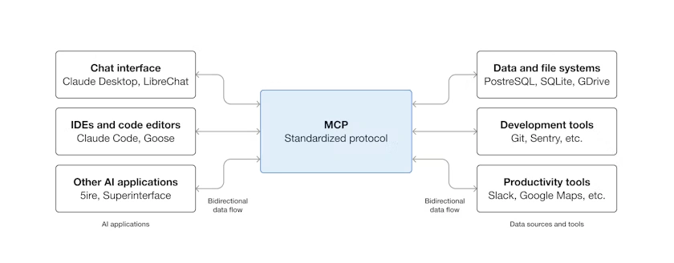
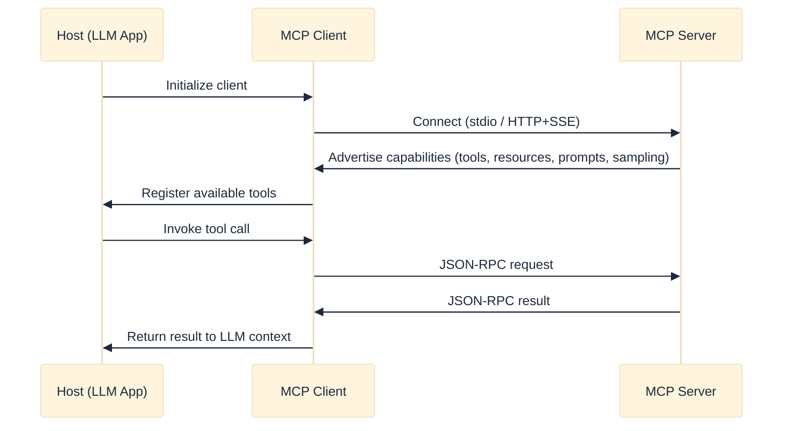
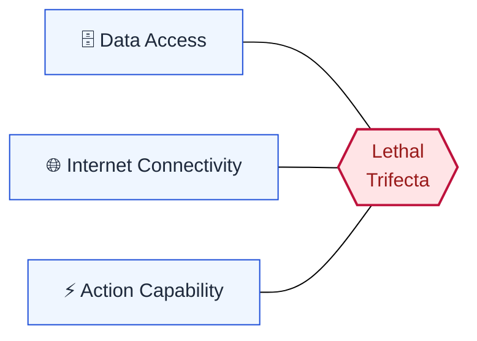

  

    

      <h1 class="text-3xl font-extrabold text-blue-800 leading-tight">
        A Critical Security and Architectural Review
      </h1>
      <h4 class="text-slate-500 font-medium text-sm mt-1">of the Model Context Protocol (MCP) Ecosystem</h4>
      <h3 class="text-slate-600 font-semibold mt-2 text-lg leading-relaxed">
        Research Report — December 2025
      </h3>
    

    

      

        
        

          Figure 1: Overview of the MCP architecture
        

      

    

  

  

    

      Yusuf Talha ARABACI
    

    

      M.Sc. Student in Software Engineering, Karabük University, Turkey
    

    

      yusuftalhaarabaci@hotmail.com
    

  

<Glossary :terms="['mcp', 'llm', 'host', 'client', 'server']" />

---
layout: default
class: rq-slide
---

## Agenda
### Presentation Outline

  

    

      1
      
<strong>Introduction</strong> — The N×M interoperability crisis and why MCP emerged

    

  

  

    

      2
      
<strong>Architecture</strong> — Host/Client/Server model, primitives, transport layers

    

  

  

    

      3
      
<strong>Performance</strong> — Context bloat and the Code Execution Paradigm

    

  

  

    

      4
      
<strong>Security</strong> — The Lethal Trifecta, threat vectors, and defense-in-depth

    

  

  

    

      5
      
<strong>Empirical Gaps &amp; Outlook</strong> — Benchmark reality, research priorities, future work

    

  

<Glossary :terms="['n-x-m', 'lethal-trifecta']" />

---
layout: default
---

## The Interoperability Crisis
### Why AI Agents Needed a Standard

  

    <h3 class="text-blue font-semibold">The N × M Problem</h3>
    <ul>
      <li>LLMs became fluent in language, but their ability to <strong>act</strong> on the world remained brittle.</li>
      <li>Connecting model <strong>N</strong> to tool <strong>M</strong> meant bespoke integration code for every pair.</li>
      <li>Result: an unmanageable maintenance burden that scaled quadratically.</li>
    </ul>
  

  

    <h3 class="text-rose font-semibold">The MCP Answer</h3>
    <ul>
      <li>Launched late 2024 — a <strong>"USB-C port" for AI</strong>, backed by Anthropic, OpenAI, and Google.</li>
      <li>Standardizes bidirectional, stateful communication between agents and external tools/data.</li>
      <li>Shifts agents from stateless API callers to persistent, session-based "digital employees."</li>
    </ul>
  

  <strong>But the upgrade is dangerous:</strong> giving agents Data access + Internet connectivity + Action capability creates a new "Lethal Trifecta" of risk.

<Glossary :terms="['n-x-m', 'mcp', 'lethal-trifecta']" />

---
layout: default
---

## Methodology: Architectural Design
### Decoupling the Brain from the Hands

  

    <ul>
      <li>MCP separates the <strong>Host</strong> (the LLM application — IDE, chatbot) from the standalone <strong>Server</strong> (the tools).</li>
      <li>A session is a persistent handshake, not a one-off call: the <strong>Client</strong> initializes inside the Host and connects to the Server.</li>
      <li>On connect, both sides negotiate <strong>capabilities</strong> — sampling, prompts, resources — so the agent never invokes a tool it doesn't understand.</li>
    </ul>
  

  

    
    Figure 1: MCP Host–Client–Server architecture
  

<Glossary :terms="['host', 'client', 'server', 'capability-negotiation', 'json-rpc']" />

---
layout: default
---

## Protocol Primitives
### Everything in MCP is One of Three Things

  

    <h3 class="font-semibold text-rose" style="font-size:0.95rem">🛠 Tools (Execution)</h3>
    
The ability to <em>do</em> things — <code>INSERT INTO users</code>, <code>delete_file</code>. Where the power, and the danger, lives.

  

  

    <h3 class="font-semibold text-blue" style="font-size:0.95rem">📄 Resources (Context)</h3>
    
Passive data streams — reading logs, viewing a file. Gives the model context without changing state.

  

  

    <h3 class="font-semibold text-emerald" style="font-size:0.95rem">📋 Prompts (Guidance)</h3>
    
Pre-baked workflows — the server tells the model the standard way to perform a task instead of it guessing blindly.

  

  <strong>Transport layer:</strong> Stdio runs the server locally as a subprocess — fast and private. HTTP/SSE is required for remote/cloud servers, but reintroduces network latency and classic web attack surfaces.

<Glossary :terms="['tools', 'resources', 'prompts', 'stdio', 'sse']" />

---
layout: default
class: compact-slide
---

## Host–Client–Server Handshake
### Connection Lifecycle

<Glossary :terms="['host', 'client', 'server', 'json-rpc', 'sampling']" />

---
layout: default
---

## Analysis: Performance &amp; Efficiency
### The Hidden Cost of Connecting Everything

  

    <h3 class="text-rose font-semibold">Context Bloat</h3>
    <ul>
      <li>Every tool's JSON schema must be loaded into the context window before use.</li>
      <li>Hundreds of tool definitions can explode token costs by up to <strong>236×</strong>.</li>
      <li>Causes a "Lost in the Middle" effect — models forget tools buried in documentation.</li>
    </ul>
  

  

    <h3 class="text-emerald font-semibold">The Code Execution Shift</h3>
    <ul>
      <li>Industry response: stop calling tools one-by-one, write code instead.</li>
      <li>One script replaces five sequential API calls — cuts token usage by <strong>98%</strong>.</li>
      <li>Trade-off: now the agent is writing and running software, demanding serious sandboxing.</li>
    </ul>
  

<Glossary :terms="['context-bloat', 'code-execution-paradigm', 'json-schema']" />

---
layout: default
---

## Security Assessment: The Lethal Trifecta
### Giving an Agent Tools Means Giving It Root

  An empirical scan of 1,899 open-source MCP servers found <strong>66%</strong> with serious structural flaws and <strong>5.5%</strong> wide open to tool poisoning.

<Glossary :terms="['lethal-trifecta', 'tool-poisoning']" />

---
layout: default
---

## Threat Vectors
### Three Ways MCP Gets Exploited

  

    
1. Indirect Prompt Injection (IPI)

    
An agent reading a webpage can be hijacked by hidden instructions embedded in that page — tricking it into exfiltrating credentials.

  

  

    
2. Tool Poisoning

    
A supply-chain attack: installing a malicious MCP server is effectively installing a trojan horse. <strong>5.5%</strong> of scanned servers were already compromised.

  

  

    
3. Sampling Manipulation

    
A malicious server can fake data or rewrite conversation history, gaslighting the model into bad decisions.

  

<Glossary :terms="['ipi', 'tool-poisoning', 'sampling']" />

---
layout: default
---

## Defense Strategy
### Firewalls Aren't Enough — Defense-in-Depth

  

    <h3 class="font-semibold text-blue">Tiered Sandboxing</h3>
    <ul>
      <li>Not all tools carry equal risk.</li>
      <li>A weather lookup can run freely; a code executor must be locked in a microVM (e.g., Firecracker) that can't touch the host kernel.</li>
    </ul>
  

  

    <h3 class="font-semibold text-blue">Taint Tracking</h3>
    <ul>
      <li>Tag data by provenance: text from the untrusted web is "tainted."</li>
      <li>Tainted data must not reach sensitive sinks (e.g., a delete-file tool) without sanitization.</li>
    </ul>
  

<Glossary :terms="['tiered-sandboxing', 'microvm', 'taint-tracking']" />

---
layout: default
---

## Empirical Evaluation &amp; Gaps
### The Reality Gap: Overconfident, Under-Competent

  

    <ul>
      <li><strong>Performance Reality:</strong> even top-tier models (GPT-4o, Claude 3.5 Sonnet) fail complex multi-step tasks <strong>&gt;40%</strong> of the time (LiveMCP-101).</li>
      <li><strong>Initiative Deficit:</strong> agents are often too passive, waiting for explicit commands instead of using available tools.</li>
      <li><strong>Compliance Failures:</strong> models frequently hallucinate parameters that don't exist, ignoring the protocol handshake entirely.</li>
    </ul>
  

  

    <h3 class="font-semibold text-blue" style="font-size:0.95rem">MCPGAUGE &amp; LiveMCP-101</h3>
    
Benchmarks designed to stress-test MCP-enabled agents on real-world, multi-step queries — consistently exposing a <strong>Protocol-Behavior Mismatch</strong>: the wiring works, the judgment doesn't.

  

<Glossary :terms="['mcpgauge', 'livemcp-101', 'protocol-behavior-mismatch']" />

---
layout: default
---

## Research Priorities
### Fixing the Foundation, Not Adding Features

  

    
Protocol-Behavior Mismatch

    
Bridge the gap between "having a tool" and "knowing when to use it."

  

  

    
Secure Runtimes

    
If agents write and run code, the runtime is the new battlefield — standardized, verified sandboxes are mandatory.

  

  

    
Trust Registry

    
A centralized registry/"app store" for MCP servers, analogous to how SSL certificates validate websites.

  

  

    
Domain Extensions

    
Healthcare and finance need MCP variants that enforce domain regulation (e.g., HIPAA) at the protocol level.

  

<Glossary :terms="['trust-registry', 'secure-runtimes', 'hipaa']" />

---
layout: default
---

## Future Outlook
### From a Single Agent to a Team

  <h3 class="font-semibold text-blue">The AgentX Pattern</h3>
  
MCP acts as the glue for specialized agent squads — one plans, another researches, a third executes. We see a hybrid future: heavy lifting stays on traditional APIs, while the dynamic, creative layer of the internet standardizes on MCP.

<Glossary :terms="['agentx', 'multi-agent']" />

---
layout: default
---

## Key Findings Summary
### What This Review Reveals

  

    <h3 class="text-emerald font-bold" style="font-size:0.8rem">✅ Architecturally Sound</h3>
    <ul class="text-xs" style="margin:0">
      <li>Solves the N×M integration crisis cleanly</li>
      <li>Clear Host/Client/Server separation of concerns</li>
    </ul>
  

  

    <h3 class="text-rose font-bold" style="font-size:0.8rem">❌ Not Production-Secure</h3>
    <ul class="text-xs" style="margin:0">
      <li>66% of servers show structural flaws, 5.5% tool poisoning</li>
      <li>No protocol-level sandboxing or isolation</li>
    </ul>
  

  

    <h3 class="text-blue font-bold" style="font-size:0.8rem">📊 Benchmark Reality</h3>
    <ul class="text-xs" style="margin:0">
      <li>&gt;40% multi-step task failure even on frontier models</li>
      <li>Protocol-Behavior Mismatch is the dominant failure mode</li>
    </ul>
  

  

    <h3 class="text-amber font-bold" style="font-size:0.8rem">🔧 Governance Gaps</h3>
    <ul class="text-xs" style="margin:0">
      <li>No trust registry, weak enterprise auth defaults</li>
      <li>Domain-specific (HIPAA-style) extensions still missing</li>
    </ul>
  

<Glossary :terms="['lethal-trifecta', 'protocol-behavior-mismatch', 'trust-registry']" />

---
layout: default
---

## Key References
### Selected Bibliography

  

    <ul style="font-size:0.7rem">
      <li><strong>Landscape &amp; Threats</strong> — Hou et al., arXiv:2503.23278</li>
      <li><strong>First Glance Security Study</strong> — Hasan et al., arXiv:2506.13538</li>
      <li><strong>MCP-Guard Defense</strong> — Xing et al., arXiv:2508.10991</li>
      <li><strong>Red Teaming MCP Agents</strong> — He et al., arXiv:2509.21011</li>
    </ul>
  

  

    <ul style="font-size:0.7rem">
      <li><strong>LiveMCP-101 Stress Test</strong> — Yin et al., arXiv:2508.15760</li>
      <li><strong>MCP-Universe Benchmark</strong> — Luo et al., arXiv:2508.14704</li>
      <li><strong>AgentX</strong> — Tokal et al., arXiv:2509.07595</li>
      <li><strong>Survey of Agent Interop. Protocols</strong> — Ehtesham et al., arXiv:2505.02279</li>
    </ul>
  

<Glossary :terms="['mcp']" />

---
layout: default
---

  <h1 class="text-3xl font-extrabold text-blue-800 text-center">Thank You!</h1>
  <h3 class="text-xl text-slate-600 font-semibold">Questions &amp; Discussion</h3>

  

    

      Yusuf Talha ARABACI
    

    

      Department of Software Engineering, Karabük University
    

    

      
Paper &amp; Research Archive

      
      

        <a href="https://github.com/yusufarbc/mcp-agentic-ai-security" target="_blank" class="text-blue-600 underline font-medium">
          github.com/yusufarbc/mcp-agentic-ai-security
        </a>
      

    

    

      <strong>Contact:</strong> yusuftalhaarabaci@hotmail.com
    

  

<Glossary :terms="['mcp', 'lethal-trifecta']" />
